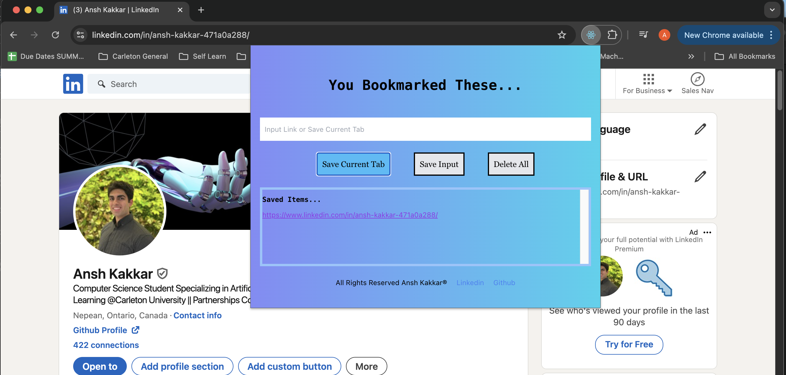

#BookMark Buddy Chrome Extension
##Made with TypeScript, React.ts, Tailwind CSS, HTML, CSS, FireBase (Still Implementing)

##How Links are Saved?
#### Using Web Storage API we can access local storage to keep our bookmarks saved even after we have clicked off the extension

##Save Current Tab
#### Useful to save Linkedin Profiles, Resources or any link that we want to store for fast access

##Save Input
#### We can also type in the link manually and save it for later

##Delete All
#### We can clear local storage and rest all our saved Bookmarks

